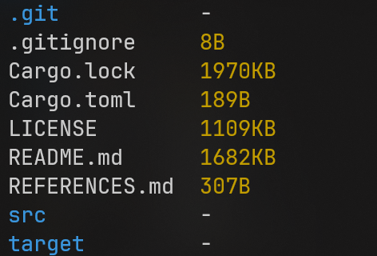

# LSR - A Rust Implementation of LS for Windows(and possibly other platforms)

**This is underdevelopment**



## Quick Start

For now, I only tested this code on the Windows platform. Feel free to test in any other platform and tell me the results!
If you want run the project I recommend building it with Rust.
You will need Rust installed.

Clone the project and in the same directory open console and:

```console
cargo build
cargo run
```

## RoadMap

| Development | Status |
| :--- | :----: |
| Testing | Not done |
| CMD Arguments* | Not done |
| Listing specific dir* | Not done |
| Hiding dot files in default execution* | Not done |
| Listing with subdirs* | Not done |

My plan basically is to implement the whole ``ls`` functionality in this program, so this roadmap will problaby get big very soon!
*These will be CMD arguments.

## Contributing

### Bug fixes

Any bug fixes are welcome. I am new to the rust language so when issuing a PR please consider describing the bug!


### Improvements

You can do a PR if you want to implement a feature from the roadmap! If testing is already a thing you should PR all your changes with testing.

Also, I want to stay to vanilla rust as possible, so if you introduce a new package, we can discuss the possibility.

### Tips

You can issue a tip for me related to project structure, CI/Testing, Coding, etc. I'm new to the world of Open Source and I am open to learn.

## Final Considerations

This is my first try at Open Source, I know there's probably a thousand better implementations of the LS command in Rust. But I want to experience how Open Source works :) Thanks for passing by!
